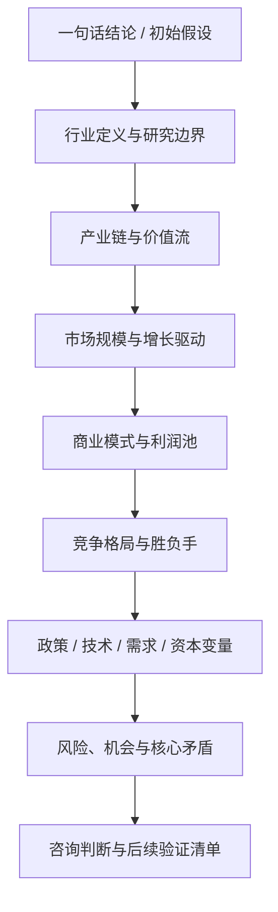

# Quick Industry Research

## Purpose

快速产出一份专业的陌生行业初步研究简报。优先保证研究边界清楚、判断可用、来源明确、结构可复用，并为后续深挖保留扩展空间。

本 Skill 的目标不是整理一份资料清单，而是用咨询公司和行研报告常见的逻辑链回答一组递进问题：

1. 这个行业值得看吗。
2. 我们到底在研究什么。
3. 它是如何运转的。
4. 这个赛道空间有多大、增长来自哪里。
5. 行业内的钱是怎么赚的、利润在哪里。
6. 谁会赢、为什么会赢、壁垒是什么。
7. 政策、技术、需求、资本哪些因素会改变格局。
8. 最终意味着什么，下一步验证什么。

## Total Research Logic



## Question Progression


## When to use this skill

在以下场景优先使用本 Skill：

- 咨询项目行业预研
- 陌生客户或陌生赛道快速理解
- 投研初筛
- 商业分析
- 竞品分析
- 面试前行业准备
- 新业务机会判断
- 需要在有限时间内快速形成行业认知的场景

## When not to use this skill

以下场景不应把本 Skill 当成最终方案：

- 用户需要完整尽调报告或深度专项研究
- 用户需要法律、医疗、投资建议等高风险结论
- 用户只需要一句话百科式解释
- 用户已经指定非常窄的公司财务建模任务
- 用户需要实时交易决策
- 用户没有要求行业层面的结构化分析

遇到这些场景时，可以说明本 Skill 适合作为第一轮认知搭建，再建议更匹配的方法。

## Required inputs

优先收集以下输入。若信息不完整，不要反复追问；先建立工作假设，再把假设写清楚。

```markdown
- Industry:
- Country or region:
- Research purpose:
- Output depth: quick scan / standard brief / deep pre-research
- Time budget:
- Priority topics: policy / data / competitors / value chain / customer demand / technology trends / content ecosystem / cases
- Required output language:
- Whether sources and links are required:
```

## Assumptions when inputs are missing

若用户未提供完整信息，基于上下文合理假设，并在输出开头显式写出假设条件。

示例：

```markdown
## Assumptions
- Region assumed: China
- Output depth assumed: standard brief
- Time budget assumed: 1 hour
- Source requirement assumed: cite key sources where available
```

默认处理原则：

- 地区缺失时，优先采用用户语境中最可能的市场
- 时间预算缺失时，默认按 1 小时标准简报执行
- 输出深度缺失时，默认 `standard brief`
- 来源要求缺失时，默认对关键事实和关键数字附来源

## Workflow

### 1. Establish the investment or consulting relevance

Core question this step answers:

- 这个行业是否值得进入正式研究流程。

Why this must happen first:

- 如果行业本身缺少实际商业意义、研究目的不清或时间预算与任务不匹配，后续所有分析都会变成低效堆料。
- 先明确“为什么看”，才能决定后续应采用多宽的边界、多少深度和什么判断标准。

Evidence or data to use:

- 用户给出的研究目的
- 公开可见的市场热度、政策热度、融资热度、公司参与度
- 能否在短时间内找到足够可信的基础事实

Judgment to form:

- 该行业是否适合做 1 小时初步研究
- 当前更适合做快速扫描还是标准简报
- 需要围绕什么核心问题组织全文

How this leads to the next step:

- 一旦确认“值得看”以及“为什么看”，下一步就必须把行业边界定清楚，否则后面的市场规模、竞品、政策分析都会口径混乱。

Recommended output format:

- 一句话研究目标
- 一段初始假设
- 一个简短的研究范围说明

Transition / implication:

- 因此，下一步需要明确我们到底在研究什么，避免后续所有结论建立在模糊对象之上。

### 2. Define the industry boundary

Core question this step answers:

- 我们研究的对象到底是什么，不是什么。

Why this must happen after the previous step:

- 只有在明确研究目的后，才能决定边界应该宽到什么程度，哪些相邻赛道需要纳入，哪些只作为背景说明。

Evidence or data to use:

- 行业定义、政策定义、上市公司口径、研究机构口径
- 相邻概念、常见混用术语、应用场景与技术路径的区分
- 地理范围、时间范围、统计口径

Judgment to form:

- 本次研究采用何种边界
- 哪些内容属于核心行业，哪些属于支撑条件，哪些明确排除
- 哪些口径差异会直接影响后续市场和竞争判断

How this leads to the next step:

- 行业边界一旦确定，下一步就可以拆行业结构，识别价值流、成本流和关键控制点。

Recommended output format:

- 行业定义段落
- Included / excluded scope 列表
- Adjacent concepts 对照表

Transition / implication:

- 这一边界将直接决定后续产业链怎么拆、市场规模怎么取数、竞争对手怎么筛选。

### 3. Map the industry structure and value flow

Core question this step answers:

- 行业如何运转，价值如何在不同环节之间流动。

Why this must happen after boundary definition:

- 如果没有清晰边界，产业链拆解会把不相关角色混在一起，导致后面利润池和竞争判断失真。

Evidence or data to use:

- 上中下游关系
- 供应商、制造商、品牌方、平台、渠道、服务商、监管方和终端用户
- 流量入口、基础设施、合规门槛、议价关系

Judgment to form:

- 哪些环节掌握核心控制点
- 哪些环节贡献主要收入，哪些环节贡献主要利润
- 行业结构更接近线性链条、平台网络还是生态协同

How this leads to the next step:

- 只有理解了行业如何运转，后续才能判断增长空间是出现在全链条、某一环节，还是某一细分节点。

Recommended output format:

- 产业链与价值流图
- 关键角色表
- 利润池初判

Transition / implication:

- 因此，下一步需要识别这些结构中哪些部分承载了真实需求和增长空间，而不是只看一个总市场数字。

### 4. Assess market space and growth drivers

Core question this step answers:

- 市场有多大，增长来自哪里，这个空间是否足以支持后续商业判断。

Why this must happen after structure analysis:

- 单独看市场规模没有意义。必须先知道行业结构，才能判断市场数字对应的是哪个环节、哪个口径，以及增长真正发生在哪里。

Evidence or data to use:

- 市场规模、增速、渗透率、销量、用户规模、区域分布
- 历史数据与第三方预测
- 不同来源之间的口径差异

Judgment to form:

- 行业是大而慢、还是小而快
- 增长由需求扩张、供给改善、政策刺激还是技术普及驱动
- 行业处于萌芽、扩张、分化、整合还是成熟阶段

How this leads to the next step:

- 市场吸引力只有在盈利逻辑成立时才有意义，因此下一步必须分析商业模式和利润池。

Recommended output format:

- 市场数据表
- 行业阶段判断
- 增长驱动拆解

Transition / implication:

- 由于市场规模本身不能说明盈利质量，下一步需要分析商业模式、单位经济性和利润池分布。

### 5. Analyze business model and profit pool

Core question this step answers:

- 行业内的钱是怎么赚的，利润主要落在哪些环节和哪些模式上。

Why this must happen after market assessment:

- 即使行业空间足够大，如果商业模式不成立、单位经济性薄弱或利润池被上游/平台吸走，也未必值得进入。

Evidence or data to use:

- 收入来源、成本结构、毛利率逻辑、收费方式、获客路径、留存路径
- 典型公司商业模式
- 必要时调用 [database-framework.md](database-framework.md) 中的研究资产框架

Judgment to form:

- 哪些商业模式更可持续
- 哪些环节具备高利润池
- 进入壁垒来自规模、技术、品牌、渠道还是合规

How this leads to the next step:

- 商业模式差异会直接解释为什么有些玩家更强，因此下一步需要进入竞争格局分析。

Recommended output format:

- 商业模式对比表
- 利润池说明
- Unit economics / leverage 简析

Transition / implication:

- 商业模式差异最终会体现在谁能长期胜出，因此下一步需要判断行业中的赢家、胜负手与壁垒结构。

### 6. Analyze competitive landscape and winning logic

Core question this step answers:

- 谁更可能赢，为什么能赢，壁垒是什么。

Why this must happen after business-model analysis:

- 竞争不是简单列公司名单，而是要结合商业模式、利润池和控制点判断谁在行业中拥有结构性优势。

Evidence or data to use:

- 头部企业、代表品牌、关键平台或典型参与者
- 市场份额、渠道覆盖、技术能力、品牌势能、合规资质、资本实力
- 用户定位和差异化能力

Judgment to form:

- 行业集中度和分层情况
- 主要胜负手是价格、产品、服务、渠道、技术、生态还是政策门槛
- 新进入者可能在哪些位置切入

How this leads to the next step:

- 竞争格局不是静态的，它会被政策、技术、需求和资本变量持续改写，因此下一步要识别外部变量。

Recommended output format:

- 竞争分层表
- 胜负手分析
- 进入壁垒判断

Transition / implication:

- 竞争格局的差异最终会受到政策和技术变量影响，因此下一步必须分析外部驱动如何改变游戏规则。

### 7. Review external drivers and regime shifts

Core question this step answers:

- 哪些外部变量会改变行业格局、增长速度、竞争结果和进入时点。

Why this must happen after competitive analysis:

- 外部变量只有放在现有产业结构和竞争格局中，才能判断它究竟是利好谁、压制谁，还是改变整个利润分配。

Evidence or data to use:

- 政策与监管
- 技术趋势与成熟度
- 需求侧变化与用户行为
- 宏观环境与资本市场因素

Judgment to form:

- 哪些驱动是短期催化，哪些是中长期结构趋势
- 哪些变化会放大领先者优势，哪些会给新进入者窗口
- 当前行业最大的外部不确定性是什么

How this leads to the next step:

- 一旦知道哪些变量会改变行业格局，下一步就能回扣前文，提炼核心矛盾、主要风险和关键机会。

Recommended output format:

- 外部驱动因素矩阵
- 影响机制说明
- 时间跨度判断

Transition / implication:

- 外部变量的方向和强弱，将决定行业机会是否真实可兑现，也决定风险是短期噪音还是结构性问题。

### 8. Synthesize core contradictions, risks, and opportunities

Core question this step answers:

- 综合前面所有分析，行业当前最关键的矛盾、风险和机会分别是什么。

Why this must happen after all prior steps:

- 风险和机会不能凭直觉列举，必须基于边界、结构、市场、盈利、竞争和外部变量的综合判断。

Evidence or data to use:

- 前述各章节中的关键事实、估计、判断和未决变量
- 用户痛点、经营瓶颈、结构性障碍、政策与技术不确定性

Judgment to form:

- 行业最重要的核心矛盾
- 最值得关注的机会在哪里
- 哪些风险最可能改变最终判断
- 哪些问题必须继续验证

How this leads to the next step:

- 只有在机会和风险被同时衡量后，才可以给出可执行的咨询判断和下一步研究建议。

Recommended output format:

- 风险机会矩阵
- Core contradiction 摘要
- To verify 列表

Transition / implication:

- 既然机会和风险已经回扣到前文证据，最后一步就应该把这些判断整理成一份可直接用于决策讨论的咨询式结论。

### 9. Produce the consulting-style brief

Core question this step answers:

- 如何把前面所有分析收束成一份结论前置、结构完整、证据可追溯的行业简报。

Why this must happen last:

- 只有在完成判断链条之后，报告才不是一堆并列章节，而是一份有因果关系和决策含义的研究成果。

Evidence or data to use:

- 全部核心章节结论
- 来源清单与证据标签
- 未验证事项和后续研究建议

Judgment to form:

- 一句话结论
- 核心判断
- 置信度与最大不确定性
- 下一步优先验证问题

How this leads to the next step:

- 本步骤本身是交付终点，但输出中必须显式列出下一轮验证和后续研究方向，便于从初步研究转入深挖。

Recommended output format:

- 使用 [report-template.md](report-template.md) 输出完整 Markdown 简报

Transition / implication:

- 最终交付不仅要回答“现在怎么看”，还要回答“接下来验证什么、继续研究什么”。

## Output rules

- 时间紧时优先保证研究链条完整，而不是追求信息穷尽
- 结论必须前置，每章都要形成判断，而不是只给资料
- 每个章节结尾必须有一句 Transition / Implication，说明本章如何引出下一章
- 不允许只堆砌行业信息
- 不允许每章只列 bullet points 而没有判断
- 不允许小问之间互相独立
- 不允许只写“市场规模、竞争格局、政策趋势”但不解释它们之间的因果关系
- 每个关键小问必须回答“这对最终判断意味着什么”
- 明确区分事实、解释和推断
- 关键数字和结论必须尽量附上来源或链接
- 标注假设、缺失信息和未解决矛盾点
- 保留来源冲突的数据口径，不要强行合并
- 不要虚构数据
- 对无法核实的数据必须标注 `[To verify]`
- 保持咨询风格：结论先行、结构清楚、面向判断
- 输出必须能被复制进咨询材料或内部研究文档

## Default deliverables

默认输出包括：

- 一句话行业结论
- 行业研究总逻辑图
- 结构化 Markdown 行业研究简报
- 产业链与价值流图
- 市场数据表
- 竞争分层表
- 外部驱动因素矩阵
- 风险机会矩阵
- 行业关键 KPI 列表
- 来源清单
- 后续验证优先级表

## Optional extensions

当用户明确要求，或这些内容能显著提升结果时，再额外加入：

- 八大数据库沉淀
- 竞品运营与盈利拆解
- 内容生态与流量格局分析
- 细分赛道知识地图
- 长期动态情报监控方案
- 公司案例库
- 政策时间线
- 投融资与资本市场动态
- 客户访谈提纲
- 后续深度研究计划

## Source and citation standards

优先使用以下来源层级，详见 [database-framework.md](database-framework.md)：

1. Regulators and government agencies
2. Listed company annual reports and investor presentations
3. Industry associations
4. Reputable research institutions
5. Mainstream financial media
6. Company websites and product pages
7. Expert interviews, podcasts, communities, and secondary commentary
8. Low-confidence sources that must be marked as unverified

对关键信息尽量添加证据标签：

- `[Fact]` 可核实事实
- `[Estimate]` 估算或第三方预测
- `[Judgment]` 基于事实形成的分析判断
- `[Assumption]` 在信息不足情况下的假设
- `[To verify]` 后续需要验证的信息

## Quality checklist

交付前自查：

- 是否从“值不值得看”到“后续验证什么”形成了完整研究链条
- `SKILL.md` 是否不再像散点清单，而是一个完整研究流程
- 每章是否都形成判断，并说明对下一章的影响
- 是否包含至少 2 个 Mermaid 图
- 是否解释了市场、商业模式、竞争、政策之间的因果关系
- 是否包含产业链图、市场表、竞争表、驱动矩阵、风险机会矩阵
- 是否区分事实、估计、判断、假设和待验证项
- 是否保留来源分级、证据标签、不要虚构数据、标注 `[To verify]`
- 是否适合在 1 小时内完成一版初步研究
- 是否可直接复制进咨询材料或内部研究文档

## Example invocation

Use this skill to quickly research the low-altitude economy industry in China.

Inputs:
- Industry: Low-altitude economy
- Region: China
- Research purpose: Consulting project pre-research
- Output depth: Standard brief
- Time budget: 1 hour
- Priority topics: policy, market size, value chain, competitors, business models, opportunities and risks

Expected output:
A consulting-style Markdown brief with executive thesis, industry boundary, logic map, value-chain analysis, market data table, business model analysis, competitive landscape, external-driver matrix, risk-opportunity synthesis, source list, and next-step validation priorities.

## Reference files

- Use [report-template.md](report-template.md) for the final brief structure, transition sentences, tables, and visual outputs.
- Use [database-framework.md](database-framework.md) for research asset design, source hierarchy, evidence tagging, and the 1-hour execution checklist.
