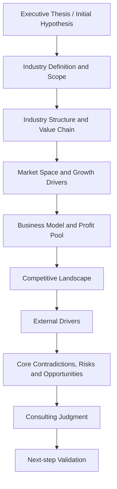

# Quick Industry Research

## Purpose

快速产出一份专业的陌生行业初步研究简报。优先保证研究边界清楚、判断可用、来源明确、结构可复用，并为后续深挖保留扩展空间。

这个 Skill 不是简单搜集资料，而是按照行研报告逻辑，快速生成一份结论前置、边界清晰、问题递进、证据支撑、图表化输出、可复用的行业研究简报。

## Research Spine

```text
初始判断 → 行业边界 → 产业链结构 → 市场空间 → 商业模式 → 竞争格局 → 外部变量 → 核心矛盾 → 风险机会 → 咨询判断 → 后续验证
```

## Total Research Logic



## Question Progression


## When to use this skill

在以下场景优先使用本 Skill：

- 咨询项目行业预研
- 陌生客户或陌生赛道快速理解
- 投研初筛
- 商业分析
- 竞品分析
- 面试前行业准备
- 新业务机会判断
- 需要在有限时间内快速形成行业认知的场景

## When not to use this skill

以下场景不应把本 Skill 当成最终方案：

- 用户需要完整尽调报告或深度专项研究
- 用户需要法律、医疗、投资建议等高风险结论
- 用户只需要一句话百科式解释
- 用户已经指定非常窄的公司财务建模任务
- 用户需要实时交易决策
- 用户没有要求行业层面的结构化分析

## Required inputs

优先收集以下输入。若信息不完整，不要反复追问；先建立工作假设，再把假设写清楚。

```markdown
- Industry:
- Country or region:
- Research purpose:
- Output depth: quick scan / standard brief / deep pre-research
- Time budget:
- Priority topics: policy / data / competitors / value chain / customer demand / technology trends / content ecosystem / cases
- Required output language:
- Whether sources and links are required:
- Include key company comparison: Yes
- Include policy timeline: Yes
- Include entry recommendations: Yes
```

## Assumptions when inputs are missing

若用户未提供完整信息，基于上下文合理假设，并在输出开头显式写出假设条件。

示例：

```markdown
## Assumptions
- Region assumed: China
- Output depth assumed: standard brief
- Time budget assumed: 1 hour
- Source requirement assumed: cite key sources where available
- Enhanced tables assumed: yes
```

默认处理原则：

- 地区缺失时，优先采用用户语境中最可能的市场
- 时间预算缺失时，默认按 1 小时标准简报执行
- 输出深度缺失时，默认 `standard brief`
- 来源要求缺失时，默认对关键事实和关键数字附来源
- 若未说明是否需要增强模块，默认包含重点公司对比表、政策时间线、进入建议与优先动作

## Workflow

## Step 1. Establish relevance and initial thesis

**Core question:**

- 这个行业是否值得进入正式研究流程，当前研究应该围绕什么核心判断展开。

**Why this follows the previous step:**

- 这是研究起点。若连“为什么看”都不清楚，后续边界、数据和结论都会失焦。

**Evidence / data to use:**

- 用户研究目的
- 行业热度、政策热度、融资热度、头部公司参与度
- 是否能在有限时间内找到足够可信的基础事实

**Judgment to form:**

- 是否值得做 1 小时快速研究
- 本次是机会判断、进入判断、客户背景理解还是投研初筛
- 初始 thesis 是什么

**How this leads to the next step:**

- 只有明确“为什么看”，才能决定后续研究边界到底该宽还是窄。

**Recommended output format:**

- 一句话研究目标
- 初始假设
- 研究范围说明

**Transition / implication:**

- 因此，下一步必须先界定我们到底在研究什么，否则后续所有分析都会出现口径混乱。

## Step 2. Define industry boundary and scope

**Core question:**

- 我们研究的对象到底是什么，不是什么。

**Why this follows the previous step:**

- 研究目标决定边界宽度。边界不清会直接破坏市场、竞品、政策和盈利分析的一致性。

**Evidence / data to use:**

- 行业定义口径
- 政策口径
- 上市公司与研究机构口径
- 相邻概念、应用场景、支撑技术、统计范围

**Judgment to form:**

- 采用哪一种边界
- 哪些内容纳入，哪些内容排除
- 哪些口径差异会影响后续判断

**How this leads to the next step:**

- 边界确定后，才能拆结构、识别价值流和利润池。

**Recommended output format:**

- 行业定义段落
- Included / excluded scope list
- Adjacent concept comparison table

**Transition / implication:**

- 行业边界将直接决定产业链怎么拆、市场数据怎么取、竞争对手怎么筛选。

## Step 3. Map industry structure and value chain

**Core question:**

- 行业如何运转，价值、成本和利润如何在链条中流动。

**Why this follows the previous step:**

- 只有边界清楚，产业链拆解才不会把不相关角色混入同一逻辑。

**Evidence / data to use:**

- 上游、中游、下游、配套角色
- 供应商、制造商、品牌方、平台、渠道、服务商、监管方、终端用户
- 议价关系、控制点、进入门槛

**Judgment to form:**

- 哪些环节掌握核心控制点
- 哪些环节贡献收入，哪些环节贡献利润
- 行业更像线性链条、平台网络还是生态系统

**How this leads to the next step:**

- 搞清楚行业结构后，才能判断增长空间到底出现在全行业还是某些特定环节。

**Recommended output format:**

- 产业链与价值流图
- 产业链分析表
- 关键控制点与利润池摘要

**Transition / implication:**

- 既然结构已经明确，下一步就需要判断这些环节承载的市场空间到底有多大，以及增长来自哪里。

## Step 4. Assess market space and growth drivers

**Core question:**

- 市场有多大，增长来自哪里，这种增长是否足以支撑后续商业判断。

**Why this follows the previous step:**

- 市场空间必须建立在明确结构和明确口径之上，否则数字容易被误读。

**Evidence / data to use:**

- 市场规模、增速、渗透率、销量、用户规模、价格区间、区域分布
- 历史数据与第三方预测
- 数据来源与口径差异

**Judgment to form:**

- 行业是大而慢、小而快，还是结构性分化
- 增长由需求扩张、供给改善、政策刺激还是技术普及驱动
- 行业处于萌芽、扩张、分化、整合还是成熟阶段

**How this leads to the next step:**

- 市场大不等于值得进入，下一步必须看盈利质量和利润池分布。

**Recommended output format:**

- 市场数据表
- 扩展市场明细表
- 行业阶段判断

**Transition / implication:**

- 由于市场空间本身不能证明商业价值，下一步必须分析行业到底怎么赚钱、钱留在哪里。

## Step 5. Analyze business model and profit pool

**Core question:**

- 行业内的钱是怎么赚的，利润主要落在哪些模式和环节。

**Why this follows the previous step:**

- 即使市场足够大，如果盈利逻辑不成立或利润池被他人占据，行业吸引力仍然有限。

**Evidence / data to use:**

- 收入来源、价格机制、成本结构、毛利逻辑、单位经济性、运营杠杆
- 典型公司商业模式
- 场景盈利模型

**Judgment to form:**

- 哪些商业模式更可持续
- 哪些环节拥有更高利润池
- 进入壁垒来自规模、技术、渠道、品牌还是合规

**How this leads to the next step:**

- 商业模式差异决定了谁更可能在竞争中赢得利润。

**Recommended output format:**

- 商业模式表
- 利润池摘要
- 场景优先级判断

**Transition / implication:**

- 既然商业模式差异决定盈利质量，下一步就要判断谁更有能力长期捕获这些利润。

## Step 6. Analyze competitive landscape and winning logic

**Core question:**

- 谁会赢，为什么会赢，壁垒在哪里。

**Why this follows the previous step:**

- 竞争分析不能只列公司名，必须建立在利润池和控制点判断之上。

**Evidence / data to use:**

- 头部企业、代表品牌、关键平台
- 市场份额或替代指标
- 渠道能力、技术能力、品牌势能、合规资质、资本实力

**Judgment to form:**

- 行业集中度和分层情况
- 主要胜负手是什么
- 新进入者应该避开什么、切入什么

**How this leads to the next step:**

- 竞争格局不是静态的，政策、技术、需求和资本变量会继续改写格局。

**Recommended output format:**

- 竞争格局表
- 重点公司对比表
- Partner / competitor map

**Transition / implication:**

- 因此，下一步必须分析哪些外部变量会放大领先者优势，或为新进入者打开窗口。

## Step 7. Review external drivers and game changers

**Core question:**

- 什么外部变量会改变行业节奏、竞争结果和进入时点。

**Why this follows the previous step:**

- 竞争优势只有放在政策、技术、需求和资本环境中，才能判断其持续性。

**Evidence / data to use:**

- 政策监管、牌照、标准
- 技术趋势与成熟度
- 需求变化与用户行为
- 宏观环境与资本市场因素

**Judgment to form:**

- 哪些变量是短期催化，哪些是中长期趋势
- 哪些因素会放大龙头优势，哪些会创造新窗口
- 当前最大外部不确定性是什么

**How this leads to the next step:**

- 外部变量会重新定义风险和机会，所以下一步要把这些影响收束为核心矛盾与判断。

**Recommended output format:**

- 外部驱动因素矩阵
- 政策时间线
- 场景成熟度与时间窗口判断

**Transition / implication:**

- 既然外部变量已经明确，下一步就必须回扣前文证据，判断真正值得押注的机会和最需要警惕的风险。

## Step 8. Synthesize core contradictions, risks, and opportunities

**Core question:**

- 行业当前最关键的核心矛盾、风险和机会分别是什么。

**Why this follows the previous step:**

- 风险和机会不能凭感觉列举，必须建立在边界、结构、市场、盈利、竞争和外部变量的综合分析上。

**Evidence / data to use:**

- 前述章节中的关键事实、估计、判断和未决变量
- 用户痛点、经营瓶颈、结构性障碍、政策与技术不确定性

**Judgment to form:**

- 核心矛盾是什么
- 最有价值的机会在哪里
- 哪些风险最可能改变最终判断
- 哪些问题必须继续验证

**How this leads to the next step:**

- 只有把机会和风险一起衡量，最后的咨询判断才有可执行意义。

**Recommended output format:**

- 风险机会矩阵
- Core contradiction summary
- 进入建议与优先动作草案

**Transition / implication:**

- 下一步需要把这些判断收束成结论前置、可执行、可验证的咨询式简报。

## Step 9. Produce the consulting-style brief

**Core question:**

- 如何把前面所有分析转化成一份真正能用的咨询式行业简报。

**Why this follows the previous step:**

- 只有完成判断链条，报告才不是堆叠章节，而是一份有因果、有优先级、有行动指向的研究产物。

**Evidence / data to use:**

- 所有前序章节结论
- 来源清单与证据标签
- 后续验证问题

**Judgment to form:**

- 一句话结论
- 核心判断
- 置信度与最大不确定性
- 下一步验证优先级

**How this leads to the next step:**

- 本步骤是交付终点，但输出必须为下一轮深挖保留验证接口。

**Recommended output format:**

- 使用 [report-template.md](report-template.md) 输出完整 Markdown 简报

**Transition / implication:**

- 最终交付不仅要回答“现在怎么看”，还要回答“接下来验证什么、先做什么”。

## Output rules

- 不允许只堆砌行业信息
- 不允许每章只列 bullet points 而没有判断
- 不允许只写事实不写判断
- 不允许章节之间没有承接
- 不允许只写“市场规模、竞争格局、政策趋势”而不解释因果关系
- 每个章节必须回答 `So what?`
- 每个章节结尾必须写 `Transition / Implication`
- 时间紧时优先保证研究链条完整，而不是追求信息穷尽
- 结论必须前置，每章都要形成判断
- 明确区分事实、估计、判断、假设
- 对不确定信息必须标注 `[To verify]`
- 关键数字和结论必须尽量附上来源或链接
- 保留来源冲突的数据口径，不要强行合并
- 标注假设、缺失信息和未解决矛盾点
- 不要虚构数据
- 如果给出进入建议，必须回扣前文的市场、盈利、竞争和政策判断
- 如果给出重点公司结论，不能只列公司名，必须说明其胜负手与局限
- 如果给出政策时间线，必须说明每个政策节点对行业意味着什么
- 输出必须能被复制进咨询材料或内部研究文档

## Default deliverables

最终版默认输出包括：

- 一句话行业结论
- 行业研究总逻辑图
- 结构化 Markdown 行业研究简报
- 产业链与价值流图
- 市场数据表
- 扩展市场明细表
- 产业链分析表
- 商业模式表
- 竞争格局表
- 重点公司对比表
- 外部驱动因素矩阵
- 政策时间线
- 风险机会矩阵
- 行业关键 KPI 列表
- 关键控制点与利润池摘要
- 来源和证据说明表
- 后续验证优先级表
- 进入建议与优先动作

## Optional extensions

以下内容作为最终版之外的进一步扩展，仅在用户明确要求时加入：

- 八大数据库沉淀
- 竞品运营与盈利拆解
- 内容生态与流量格局分析
- 细分赛道知识地图
- 长期动态情报监控方案
- 公司案例库
- 投融资与资本市场动态
- 客户访谈提纲
- 后续深度研究计划

## Source and citation standards

优先使用以下来源层级，详见 [database-framework.md](database-framework.md)：

1. Regulators and government agencies
2. Listed company annual reports and investor presentations
3. Industry associations
4. Reputable research institutions
5. Mainstream financial media
6. Company websites and product pages
7. Expert interviews, podcasts, communities, and secondary commentary
8. Low-confidence sources that must be marked as unverified

对关键信息尽量添加证据标签：

- `[Fact]` 可核实事实
- `[Estimate]` 估算或第三方预测
- `[Judgment]` 基于事实形成的分析判断
- `[Assumption]` 在信息不足情况下的假设
- `[To verify]` 后续需要验证的信息

## Quality checklist

交付前自查：

- 是否从“值不值得看”到“后续验证什么”形成了完整研究链条
- `SKILL.md` 是否是完整研究流程，而不是散点清单
- 每章是否都形成判断，并说明对下一章的影响
- 是否包含至少 3 个 Mermaid 图
- 是否包含至少 7 个 Markdown 表格模板
- 是否解释了市场、商业模式、竞争、政策之间的因果关系
- 是否保留来源分级、证据标签、不要虚构数据、标注 `[To verify]`
- 是否适合在 1 小时内完成一版初步研究
- 是否可直接复制进咨询材料或内部研究文档

## Example invocation

Use this skill to quickly research the low-altitude economy industry in China.

Inputs:
- Industry: Low-altitude economy
- Region: China
- Research purpose: Consulting project pre-research
- Output depth: Standard brief
- Time budget: 1 hour
- Priority topics: policy, market size, value chain, competitors, business models, opportunities and risks

Expected output:

- executive thesis
- logic map
- industry boundary
- value-chain and profit-pool analysis
- market tables
- business-model analysis
- competition tiering
- company comparison
- policy timeline
- risk-opportunity synthesis
- validation priorities

## Chinese default prompt template

```markdown
请使用 $quick-industry-research，对【行业名称】进行增强版行业研究，并输出一份咨询风格的 Markdown 简报。

研究参数：
- 行业：
- 国家/地区：
- 研究目的：
- 输出深度：标准简报
- 时间预算：1 小时
- 输出语言：中文
- 需要来源与链接：是

请按“结论前置、问题递进、证据支撑、图表化输出”的方式完成研究，必须包含：
- 一句话结论与核心判断
- 行业研究总逻辑图
- 行业定义与研究边界
- 产业链与价值流图
- 市场数据表与扩展市场明细表
- 商业模式与利润池分析
- 竞争分层表与重点公司对比表
- 外部驱动因素矩阵
- 政策时间线
- 风险机会矩阵
- 行业关键 KPI
- 进入建议与优先动作
- 后续验证优先级表
- 来源清单与证据标签

请不要只罗列资料。每一章都必须回答“这对最终判断意味着什么”，并在章节结尾写一句 Transition / Implication，说明为什么进入下一章。
```

## Reference files

- Use [report-template.md](report-template.md) for the final brief structure, transition sentences, tables, and visual outputs.
- Use [database-framework.md](database-framework.md) for research asset design, source hierarchy, evidence tagging, and the 1-hour execution checklist.
