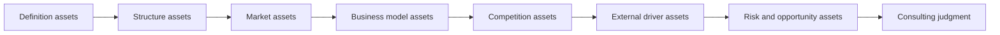

# Quick Industry Research Asset Framework

This file defines how to convert rapid industry research into reusable research assets. These databases are not passive storage buckets. Each one exists to answer a specific research question, support a specific judgment, and feed a specific chart, table, or conclusion in the final brief.

## Research Asset Logic

## 1. Industry definition database

This database serves:

- 回答 `What exactly are we studying?`
- 为报告中的 `Research Scope and Initial Hypothesis` 与 `Industry Definition` 章节提供基础

Fields to collect:

- 行业定义
- 研究边界
- 相邻概念
- 常见误解
- 地理口径
- 时间口径
- 统计口径
- 纳入范围
- 排除范围

How it supports judgment:

- 防止后续市场数据、竞争格局和政策分析出现口径混乱
- 帮助判断哪些公司和数据应被纳入正式分析

Output it supports:

- Scope summary
- Included / excluded scope table
- Adjacent concept comparison

Data quality requirements:

- 优先采用政策口径、上市公司口径、行业协会口径或主流研究定义
- 若存在多个定义，必须保留差异并说明为何采用某一口径

## 2. Value chain database

This database serves:

- 回答 `How does the industry work?`
- 为报告中的 `Industry Structure` 章节提供结构基础

Fields to collect:

- 上游、中游、下游
- 配套角色
- 核心参与方
- 渠道关系
- 价值流
- 成本流
- 利润池
- 控制点
- 议价能力

How it supports judgment:

- 识别行业中真正掌握控制权和利润权的环节
- 为后续商业模式、利润池和竞争优势判断提供基础

Output it supports:

- 产业链图
- 价值流图
- 控制点说明

Data quality requirements:

- 不只列角色名称，必须能说明角色之间的关系
- 若行业是平台型或生态型结构，需体现网络关系而非线性链条

## 3. Market data database

This database serves:

- 回答 `How large is the opportunity?`
- 为报告中的 `Market Space` 章节提供事实基础

Fields to collect:

- 市场规模
- 增速
- 渗透率
- 用户规模
- 销量
- 价格区间
- 区域分布
- 细分赛道分布
- 数据年份
- 数据来源
- 统计范围
- 置信度标签

How it supports judgment:

- 用于判断行业是否有足够空间
- 支持增长驱动拆解和行业阶段判断
- 帮助识别“大市场低盈利”与“小市场高价值”差异

Output it supports:

- 市场数据表
- 扩展市场明细表
- 增长驱动拆解
- 行业阶段判断

Data quality requirements:

- 关键市场数据必须标注来源和口径
- 历史事实与预测值分开记录
- 对冲突来源保留差异，不强行合并

## 4. Business model database

This database serves:

- 回答 `How does the industry make money?`
- 为报告中的 `Business Model` 章节提供比较材料

Fields to collect:

- 收入来源
- 价格机制
- 成本结构
- 毛利逻辑
- 单位经济性
- 运营杠杆
- 客户获取方式
- 留存机制
- 变现路径
- 进入壁垒

How it supports judgment:

- 判断行业增长是否可转化为盈利
- 识别高利润池与低利润池环节
- 支持“值不值得进入”与“应切入哪个模式”的判断

Output it supports:

- 商业模式对比表
- 利润池分析
- Entry barrier summary

Data quality requirements:

- 至少用 1 到 3 个典型公司或模式验证
- 对没有直接财务数据的模式，可用替代证据，但需标记 `[Judgment]` 或 `[Estimate]`

## 5. Company and competitor database

This database serves:

- 回答 `Who wins and why?`
- 为报告中的 `Competitive Landscape` 章节提供核心判断素材

Fields to collect:

- 公司名或玩家类型
- 市场定位
- 产品或服务
- 渠道能力
- 技术能力
- 合规资质
- 品牌势能
- 市场份额或替代指标
- 优势来源
- 短板
- 可能策略

How it supports judgment:

- 用于判断行业集中度、胜负手和壁垒
- 帮助回答谁更有机会持续胜出
- 支持进入策略和竞争风险判断

Output it supports:

- 竞争分层表
- 重点公司对比表
- 胜负手判断
- 壁垒分析

Data quality requirements:

- 市占率缺失时可用渠道覆盖、融资能力、品牌声量、技术资质等替代
- 不允许只记录公司名而没有优势来源分析

## 6. Policy and regulation database

This database serves:

- 回答 `What changes the game from a policy perspective?`
- 为报告中的 `External Drivers` 章节提供约束与催化因素

Fields to collect:

- 政策名称
- 发布时间
- 监管机构
- 政策方向
- 适用范围
- 牌照或合规要求
- 影响机制
- 受益方
- 受损方
- 时间跨度

How it supports judgment:

- 判断行业是否受到强准入门槛或政策催化
- 帮助区分政策利好、政策限制和政策不确定性

Output it supports:

- 政策时间线
- 政策影响摘要
- 外部驱动矩阵中的 policy 行

Data quality requirements:

- 政策类信息优先使用监管机构原文或权威转述
- 不能只列标题，必须说明实际影响机制

## 7. Technology and trend database

This database serves:

- 回答 `What changes the game from a technology and trend perspective?`
- 为报告中的 `External Drivers` 与机会判断提供依据

Fields to collect:

- 关键技术
- 替代技术
- 技术成熟度
- 渗透阶段
- 创新方向
- 应用场景
- 对成本、效率、体验的影响
- 时间跨度
- 不确定性

How it supports judgment:

- 帮助判断技术是短期热点还是长期生产力变量
- 识别哪些玩家会因技术演进受益或受损

Output it supports:

- 技术趋势摘要
- 外部驱动矩阵中的 technology 行
- 机会窗口分析

Data quality requirements:

- 技术判断必须说明落地程度
- 对早期技术明确标注不确定性，不可包装成既成事实

## 8. Customer and demand database

This database serves:

- 回答 `Why does demand exist and what pain is being solved?`
- 为市场空间、商业模式和风险机会判断提供需求侧基础

Fields to collect:

- 用户画像
- 场景需求
- 购买决策因素
- 使用行为
- 用户痛点
- 需求变化趋势
- 替代方案
- 价格敏感度

How it supports judgment:

- 判断需求是否真实、刚性、可持续
- 帮助解释增长驱动与商业模式的成立条件

Output it supports:

- Demand-side driver summary
- 用户痛点摘要
- 风险机会矩阵中的需求侧证据

Data quality requirements:

- 优先使用访谈、公开用户反馈、研究资料和可验证消费行为
- 区分显性需求与推测性潜在需求

## 9. Risk and opportunity database

This database serves:

- 回答 `So what?` 与 `What to verify next?`
- 为报告中的 `Core Contradictions, Risks and Opportunities` 与 `Consulting Judgment` 提供收束材料

Fields to collect:

- 主题
- 机会
- 风险
- 核心矛盾
- 支撑证据
- 置信度
- 时间维度
- 对最终判断的影响
- 待验证问题
- 后续行动建议

How it supports judgment:

- 把前面所有分析收束为最终咨询判断
- 支持优先级排序和下一步验证计划

Output it supports:

- 风险机会矩阵
- Core contradiction summary
- 验证优先级表
- 进入建议清单

Data quality requirements:

- 每个机会都应对应至少一个关键风险
- 每条重大风险或重大机会都应能追溯到前文证据

## 10. Company case database

This database serves:

- 回答 `Which companies deserve deeper attention?`
- 为重点公司对比、案例页和后续深挖提供材料

Fields to collect:

- 公司名
- 主要赛道
- 产品 / 服务
- 商业模式
- 场景落地
- 技术或渠道优势
- 合规或资质进展
- 当前阶段
- 风险点
- 可复用经验

How it supports judgment:

- 帮助从“谁在行业里”升级到“哪些公司最值得跟踪”
- 支持对标分析、合作对象筛选和案例提炼

Output it supports:

- 重点公司对比表
- 公司案例页
- Best practice summary

Data quality requirements:

- 不允许只有公司介绍，必须说明其对行业判断的意义
- 优先使用公司公告、年报、招股书、官方披露和可信媒体

## 11. Entry strategy database

This database serves:

- 回答 `If we want to enter, where should we start?`
- 为咨询判断中的进入建议和优先动作提供依据

Fields to collect:

- 进入路径
- 对应场景
- 所需能力
- 所需资源
- 主要风险
- 进入门槛
- 验证动作
- 预期时间窗口

How it supports judgment:

- 把行业研究转成更接近行动建议的输出
- 帮助区分“值得看”与“值得现在进入”

Output it supports:

- 进入建议表
- 优先动作清单
- Validation roadmap

Data quality requirements:

- 进入建议必须回扣市场、盈利、竞争和政策四个维度
- 不允许脱离前文证据给出泛化建议

## 12. 1-hour execution checklist

### 0-5 min: Frame the question

- 明确研究目的、输出深度、时间预算和初始假设
- 判断这次是“是否值得看”的快速扫描，还是“如何看”的标准简报

### 5-12 min: Define scope and boundary

- 固定研究边界、相邻概念和排除范围
- 建立 industry definition database

### 12-20 min: Map structure and value flow

- 建立 value chain database
- 先找控制点、利润池和关键参与方，再进入市场数据

### 20-30 min: Size the market and stage

- 建立 market data database
- 输出市场数据表和行业阶段判断

### 30-38 min: Understand business model and monetization

- 建立 business model database
- 判断盈利逻辑和 entry barriers

### 38-46 min: Assess competition

- 建立 company and competitor database
- 输出竞争分层和胜负手判断

### 46-53 min: Review external drivers

- 建立 policy and regulation database、technology and trend database、customer and demand database
- 输出驱动因素矩阵

### 53-60 min: Synthesize judgment

- 建立 risk and opportunity database
- 输出核心矛盾、风险机会矩阵、后续验证优先级

## 13. Source quality hierarchy

按以下顺序优先取材：

1. Regulators and government agencies
2. Listed company annual reports and investor presentations
3. Industry associations
4. Reputable research institutions
5. Mainstream financial media
6. Company websites and product pages
7. Expert interviews, podcasts, communities, and secondary commentary
8. Low-confidence sources that must be marked as unverified

Use rules:

- 优先高置信度来源支持关键事实和关键数字
- 二手转引数据尽量追溯原始来源
- 低置信度来源只能作为补充，不可直接支撑核心结论

## 14. Evidence tagging rules

对每条关键结论、关键数字或高风险表述，尽量打上证据标签：

- `[Fact]` 可核实事实
- `[Estimate]` 估算或第三方预测
- `[Judgment]` 基于事实形成的分析判断
- `[Assumption]` 在信息不足情况下的假设
- `[To verify]` 后续需要验证的信息

Recommended practice:

- 关键市场数字至少标记为 `[Fact]` 或 `[Estimate]`
- 观点型结论尽量标记为 `[Judgment]`
- 在输入缺失时补充 `[Assumption]`
- 对拿不准的内容明确标记 `[To verify]`
