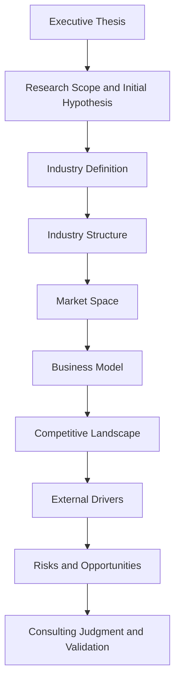
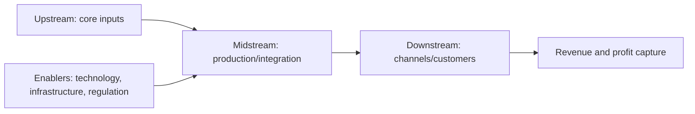

# Quick Industry Research Report Template

Use this template to produce a consulting-style quick brief. The report should read as a chain of reasoning, not a stack of unrelated sections. Each chapter must end with a short `Transition / Implication` sentence that explains how the chapter conclusion leads to the next chapter.

## Logic Map



## Template

```markdown
# [Industry] Quick Research Brief

## 0. Executive Thesis

- One-sentence conclusion:
- Core judgment:
- Confidence level:
- Key uncertainty:

Transition / Implication:
- This thesis is the current best view; the next section defines the scope and assumptions that make the conclusion valid.

## 1. Research Scope and Initial Hypothesis

- Region / time scope / research purpose:
- What is included:
- What is excluded:
- Initial hypothesis:
- Why this scope matters for later analysis:

Transition / Implication:
- Because the research scope determines which companies, market data, and policy signals count as relevant, the next section defines exactly what the industry is.

## 2. Industry Definition: What exactly are we studying?

- Definition:
- Adjacent concepts:
- Common misunderstandings:
- Data / statistical scope:

Transition / Implication:
- This boundary determines which value chain and market data should be used next.

## 3. Industry Structure: How does the industry work?

- Upstream:
- Midstream:
- Downstream:
- Enablers:
- Value flow:
- Cost flow:
- Profit pool:
- Key control points:

Industry structure diagram:



Transition / Implication:
- After understanding how value moves across the industry, the next question is whether that structure supports meaningful market space and growth.

## 4. Market Space: How large is the opportunity?

- Market size:
- Growth rate:
- Penetration rate:
- Regional or segment split:
- Data source and scope differences:
- Industry stage judgment:

Market data table:

| Metric | Value | Year | Scope | Source | Confidence | Interpretation |
| --- | --- | --- | --- | --- | --- | --- |
| Market size |  |  |  |  | Fact / Estimate |  |
| Growth rate |  |  |  |  | Fact / Estimate |  |
| Penetration rate |  |  |  |  | Fact / Estimate |  |
| User scale / volume |  |  |  |  | Fact / Estimate |  |

Transition / Implication:
- Market attractiveness only matters if business model and profit pool are viable, so the next section focuses on how the industry actually makes money.

## 5. Business Model: How does the industry make money?

- Revenue streams:
- Cost structure:
- Profit pools:
- Unit economics / operating leverage:
- Entry barriers:

Business model comparison table:

| Model | Revenue source | Cost driver | Margin logic | Key barrier | Implication |
| --- | --- | --- | --- | --- | --- |
|  |  |  |  |  |  |

Transition / Implication:
- Business model differences explain why some players outperform others, so the next section identifies who is likely to win and why.

## 6. Competitive Landscape: Who wins and why?

- Player tiers:
- Market position:
- Differentiation dimensions:
- Competitive advantages:
- Weaknesses or constraints:

Competitive landscape table:

| Tier | Player type/company | Positioning | Advantage source | Weakness | Likely strategy |
| --- | --- | --- | --- | --- | --- |
| Tier 1 |  |  |  |  |  |
| Tier 2 |  |  |  |  |  |
| Tier 3 |  |  |  |  |  |

Transition / Implication:
- Competition cannot be understood in isolation, because policy, technology, demand, and capital can still change the rules of the game.

## 7. External Drivers: What changes the game?

- Policy and regulation:
- Technology trends:
- Demand-side changes:
- Macro and capital market factors:

External-driver matrix:

| Driver | Direction | Impact mechanism | Time horizon | Beneficiaries | Risks |
| --- | --- | --- | --- | --- | --- |
| Policy | Positive / Negative / Mixed |  | Short / Medium / Long |  |  |
| Technology | Positive / Negative / Mixed |  | Short / Medium / Long |  |  |
| Demand | Positive / Negative / Mixed |  | Short / Medium / Long |  |  |
| Capital | Positive / Negative / Mixed |  | Short / Medium / Long |  |  |

Transition / Implication:
- External drivers reshape risks, opportunities, and timing, so the next section weighs these forces against the industry’s internal strengths and weaknesses.

## 8. Core Contradictions, Risks and Opportunities

- Core industry contradiction:
- User pain points:
- Operating bottlenecks:
- Structural risks:
- Growth opportunities:

Risk-opportunity matrix:

| Theme | Opportunity | Supporting evidence | Risk | Confidence | What to verify next |
| --- | --- | --- | --- | --- | --- |
|  |  |  |  |  |  |

Transition / Implication:
- Final recommendation should only come after weighing opportunity against risk, so the last section converts these findings into a consulting judgment and validation plan.

## 9. Consulting Judgment and Next-step Validation

- What matters most:
- Where to enter first:
- What to monitor:
- Biggest uncertainty:
- Recommended next research actions:

Next-step validation priority table:

| Priority | Question to verify | Why it matters | Evidence needed | Owner / next action |
| --- | --- | --- | --- | --- |
| High |  |  |  |  |
| Medium |  |  |  |  |
| Low |  |  |  |  |

Transition / Implication:
- This section closes the first-pass brief and defines the bridge from rapid research to deeper validation work.

## 10. Source List and Evidence Notes

| Source | Type | Key fact used | Reliability | Link |
| --- | --- | --- | --- | --- |
|  |  |  |  |  |
```

## Writing Rules

- Do not treat each section as an isolated bullet list.
- Every chapter must answer: `What does this mean for the final judgment?`
- Every chapter must end with a transition sentence to the next chapter.
- Prefer evidence-backed conclusions over descriptive summaries.
- Preserve uncertainty explicitly with `[Estimate]`, `[Assumption]`, and `[To verify]`.
