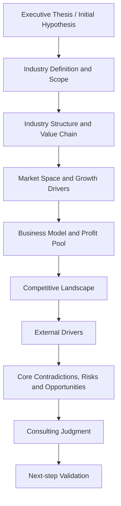
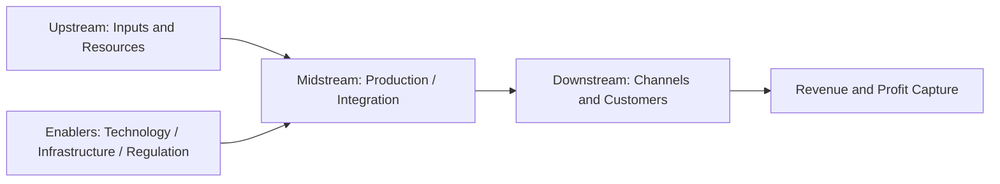

# Quick Industry Research Report Template

Use this template to produce a consulting-style quick brief. It should read as a progressive reasoning chain, not a data dump. Each chapter must contain a core question, analysis, judgment, recommended visual output, and a `Transition / Implication`.

## Logic Map



## Industry Structure and Value Flow



## Template

```markdown
# [Industry] Quick Research Brief

## 0. Executive Thesis

Core question:
- What is the current best conclusion in one sentence?

Analysis:
- One-sentence conclusion:
- Core judgment:
- Confidence level:
- Key uncertainty:

Judgment output:
- Why this industry matters now:

Recommended visual:
- One-line thesis block

Transition / Implication:
- This thesis only holds under a defined scope, so the next section sets the assumptions and research boundary.

## 1. Research Scope and Initial Hypothesis

Core question:
- What exactly is the research scope and what initial hypothesis are we testing?

Analysis:
- Region / time scope / research purpose:
- What is included:
- What is excluded:
- Initial hypothesis:
- Why this scope matters for later analysis:

Judgment output:
- Scope sufficiency and likely boundary risk:

Recommended visual:
- Scope summary box

Transition / Implication:
- Because the research scope determines which companies, market data, and policy signals count as relevant, the next section defines exactly what the industry is.

## 2. Industry Definition

Core question:
- What exactly are we studying?

Analysis:
- Definition:
- Adjacent concepts:
- Common misunderstandings:
- Data / statistical scope:

Judgment output:
- Chosen boundary and why it matters:

Recommended visual:
- Boundary comparison table

Transition / Implication:
- This boundary determines which value chain, market data, and competitors should be used next.

## 3. Industry Structure and Value Chain

Core question:
- How does the industry work and where do value, cost, and profit flow?

Analysis:
- Upstream:
- Midstream:
- Downstream:
- Enablers:
- Value flow:
- Cost flow:
- Profit pool:
- Key control points:

Judgment output:
- Which segments control economics and why:

Recommended visuals:
- Industry structure diagram
- Value-chain analysis table

Value-chain analysis table:

| Value-chain segment | Key players | Cost drivers | Revenue logic | Bargaining power | Profit potential |
| --- | --- | --- | --- | --- | --- |
| Upstream |  |  |  | High / Medium / Low |  |
| Midstream |  |  |  | High / Medium / Low |  |
| Downstream |  |  |  | High / Medium / Low |  |

Transition / Implication:
- After understanding how value moves across the industry, the next question is whether that structure supports meaningful market space and growth.

## 4. Market Space and Growth Drivers

Core question:
- How large is the opportunity, and what actually drives growth?

Analysis:
- Market size:
- Growth rate:
- Penetration rate:
- Regional or segment split:
- Data source and scope differences:
- Industry stage judgment:

Judgment output:
- Attractiveness of market size versus quality of growth:

Recommended visuals:
- Market data table
- Extended market detail table

Market data table:

| Metric | Value | Year | Scope | Source | Confidence | Interpretation |
| --- | --- | --- | --- | --- | --- | --- |
| Market size |  |  |  |  | Fact / Estimate |  |
| Growth rate |  |  |  |  | Fact / Estimate |  |
| Penetration rate |  |  |  |  | Fact / Estimate |  |

Extended market detail table:

| Segment / region | Size | Growth | Key driver | Competitive intensity | Implication |
| --- | --- | --- | --- | --- | --- |
|  |  |  |  |  |  |

Transition / Implication:
- Market attractiveness alone cannot prove industry quality, so the next section asks whether the business model converts market growth into profit.

## 5. Business Model and Profit Pool

Core question:
- How does the industry make money, and where does profit actually stay?

Analysis:
- Revenue streams:
- Cost structure:
- Profit pools:
- Unit economics / operating leverage:
- Entry barriers:

Judgment output:
- Which models are structurally attractive and which are weak:

Recommended visuals:
- Business model table
- Profit-pool summary

Business model table:

| Business model | Revenue source | Cost structure | Margin logic | Scalability | Key risk |
| --- | --- | --- | --- | --- | --- |
| Model A |  |  |  | High / Medium / Low |  |
| Model B |  |  |  | High / Medium / Low |  |

Transition / Implication:
- Business model differences explain why some players capture profit better than others, so the next section identifies who is likely to win.

## 6. Competitive Landscape

Core question:
- Who wins and why?

Analysis:
- Player tiers:
- Market position:
- Differentiation dimensions:
- Competitive advantages:
- Weaknesses or constraints:

Judgment output:
- Likely winners, structural losers, and open niches:

Recommended visuals:
- Competitive landscape table
- Key company comparison table

Competitive landscape table:

| Tier | Player type / company | Positioning | Advantage source | Weakness | Likely strategy |
| --- | --- | --- | --- | --- | --- |
| Leader |  |  |  |  |  |
| Challenger |  |  |  |  |  |
| Niche player |  |  |  |  |  |

Key company comparison table:

| Company | Core segment | Business model | Differentiator | Barrier source | Current stage | Key risk |
| --- | --- | --- | --- | --- | --- | --- |
|  |  |  |  |  |  |  |

Transition / Implication:
- Competition must be read together with policy, technology, demand, and capital shifts, because these forces can quickly reshape advantage.

## 7. External Drivers

Core question:
- What changes the game?

Analysis:
- Policy and regulation:
- Technology trends:
- Demand-side changes:
- Macro and capital market factors:

Judgment output:
- Which external variables matter most and on what timeline:

Recommended visuals:
- External-driver matrix
- Policy timeline

External-driver matrix:

| Driver | Direction | Impact mechanism | Time horizon | Beneficiaries | Risks |
| --- | --- | --- | --- | --- | --- |
| Policy | Positive / Negative / Mixed |  | Short / Medium / Long |  |  |
| Technology | Positive / Negative / Mixed |  | Short / Medium / Long |  |  |
| Demand | Positive / Negative / Mixed |  | Short / Medium / Long |  |  |
| Capital | Positive / Negative / Mixed |  | Short / Medium / Long |  |  |

Policy timeline:

| Date | Policy / event | Institution | What changed | Why it matters |
| --- | --- | --- | --- | --- |
|  |  |  |  |  |

Transition / Implication:
- External drivers reshape both upside and downside, so the next section weighs opportunity against risk and identifies the real industry contradictions.

## 8. Core Contradictions, Risks and Opportunities

Core question:
- So what are the real contradictions, risks, and opportunities?

Analysis:
- Core industry contradiction:
- User pain points:
- Operating bottlenecks:
- Structural risks:
- Growth opportunities:

Judgment output:
- Highest-conviction opportunities and most important risks:

Recommended visual:
- Risk-opportunity matrix

Risk-opportunity matrix:

| Theme | Opportunity | Supporting evidence | Risk | Confidence | What to verify next |
| --- | --- | --- | --- | --- | --- |
| Market growth |  |  |  | High / Medium / Low |  |
| Competition |  |  |  | High / Medium / Low |  |
| Policy |  |  |  | High / Medium / Low |  |

Transition / Implication:
- Once opportunity and risk are weighed together, the final task is to convert them into an actionable consulting judgment and validation plan.

## 9. Consulting Judgment and Next-step Validation

Core question:
- What should we conclude, and what must be verified next?

Analysis:
- What matters most:
- Where to enter first:
- What to monitor:
- Biggest uncertainty:
- Recommended next research actions:

Judgment output:
- Entry recommendation and decision implications:

Recommended visuals:
- Validation priority table
- Entry recommendation table

Validation priority table:

| Validation question | Why it matters | Evidence needed | Priority | Suggested source |
| --- | --- | --- | --- | --- |
|  |  |  | High / Medium / Low |  |

Entry recommendation table:

| Entry path | Why now | Required capability | Main risk | Recommended first step |
| --- | --- | --- | --- | --- |
|  |  |  |  |  |

Transition / Implication:
- This section closes the first-pass brief and creates a bridge from rapid industry research to deeper validation work.

## 10. Source List and Evidence Notes

Core question:
- What evidence supports the conclusions, and where are the limitations?

Analysis:
- Source list
- Type
- Key fact used
- Reliability
- Limitation
- Link

Judgment output:
- Source sufficiency and weakest evidence points:

Recommended visual:
- Source and evidence notes table

Source and evidence notes table:

| Source | Type | Key fact used | Reliability | Limitation | Link |
| --- | --- | --- | --- | --- | --- |
|  | Official / Research / Media / Company |  | High / Medium / Low |  |  |
```

## Writing Rules

- This report is not a data collection checklist.
- Do not treat sections as isolated bullet lists.
- Every chapter must answer: `What does this mean for the final judgment?`
- Every chapter must end with a transition sentence to the next chapter.
- Facts, estimates, judgments, assumptions, and `[To verify]` items must be separated.
- Prefer evidence-backed conclusions over descriptive summaries.
